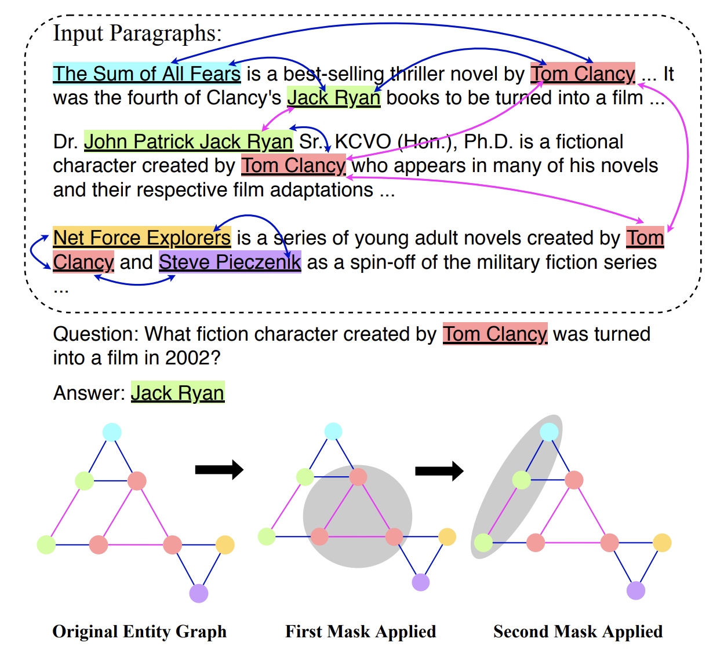

# DFGN-pytorch

A pytorch implementation of our ACL2019 paper [(arXiv)](https://arxiv.org/abs/1905.06933)

>**Dynamically Fused Graph Network for Multi-hop Reasoning**  
>Yunxuan Xiao, Yanru Qu, Lin Qiu, Hao Zhou, Lei Li, Weinan Zhang, Yong Yu  
>Accepted by ACL 2019  
  


This repo is still under construction. Currently, we have provided the core code of DFGN and pretrained checkpoints.
Although the pre-processing part is not available now, we provide processed data for you to start training.
Feel free to contact us if you have any questions.

Our result has been published on [HotpotQA Leaderboard](https://hotpotqa.github.io/).

## Requirements
python 3, pytorch 0.4.1, boto3

To install pytorch 0.4.1, you can follow the instruction on this page https://pytorch.org/get-started/previous-versions/.
For exmaple install with CUDA 9 via anaconda:
```bash
conda install pytorch=0.4.1 cuda90 -c pytorch
```

Install boto3
```bash
pip install boto3
```


## Download Data

#### Bert Models
Firstly, you should download and set bert pretrained model and vocabulary properly.
You can find the download links in *pytorch_pretrained_bert/modeling.py* row **40-51**, and *pytorch_pretrained_bert/tokenization.py* row **30-41**.
After you finish downloading, you should replace the dict value with your own local path accordingly.


#### Released Checkpoints
We also released our pretrained model for reproduction.

- [DFGN-base.tar.gz](https://drive.google.com/open?id=1yXiUyG4MzdommTp450VulfEPy5vXkkI1)

```bash
mkdir DFGN/ckpt
tar -xvzf ./DFGN-base.tar.gz -C DFGN/ckpt
```

#### Preprocessed Data
Next download our preprocessed train & dev data of HotpotQA distractor setting.

- [data.tar.gz](https://drive.google.com/open?id=1jBpCHCNaDPPAbkZ-UOhXVeYrvhKVjiiU)

Extract all compressed files into **DFGN/data** folder.
```bash
cd DFGN-pytorch/DFGN
mkdir data
tar -xvzf ./data.tar.gz -C data
cd data
wget http://curtis.ml.cmu.edu/datasets/hotpot/hotpot_dev_distractor_v1.json
```
Also you can preprocess by yourself following the instructions in the next section.
The official HotpotQA data is available in https://hotpotqa.github.io/. 


## Preprocess
Previously we provided intermediate data files for training DFGN. Now we published the code for preprocessing.
The preprocessing phase consists of paragraph selection, named entity recognition, and graph construction.

First, download model checkpoints and save them in **./work_dir**

- [bert_ner.pt](https://drive.google.com/open?id=1arXwD89DtVNOOC49CMoXP3-iiIkOMrI-)
- [para_select_model.bin](https://drive.google.com/open?id=1tcBCs3Td6pAAmO6DIvqyUfI66XHqSlVE)

Then run preprocess.sh as below, replacing ${TRAIN_FILE}, ${DEV_FILE} as the official train/dev file. You can finally
 get all preprocessed files in **\work_dir\dev** and **\work_dir\train**

```bash
CUDA_VISIBLE_DEVICES=0 bash preprocess.sh ${DEV_FILE} dev
CUDA_VISIBLE_DEVICES=0 bash preprocess.sh ${TRAIN_FILE} train
```


## Training
To train a DFGN model, we need at least 2 GPUs (One for BERT encoding, one for DFGN model).
Now training with default parameters:
```bash
cd DFGN
CUDA_VISIBLE_DEVICES=0,1 python train.py --name=YOUR_EXPNAME --q_update --q_attn --basicblock_trans --bfs_clf
```
If an OOM exception occurs, you may try to set a smaller batch size with gradient_accumulate_step > 1.

Your predictions and checkpoints in each epoch will be stored in *./output* directory. By running local evaluation script, you may get results like this:

|best iter|em|f1|pr|re|sp_em|sp_f1|sp_pr|sp_re|jt_em|jt_f1|jt_pr|jt_re|  
|-|-|-|-|-|-|-|-|-|-|-|-|-|
|epxx|	0.5542|	0.6909|	0.7169	|0.7039|	0.5218|	0.8196|	0.8604|	0.8098|	0.3325|	0.5942|	0.6435|	0.5993|


## Local Evaluation
There are two evaluation scripts here.

The first is the official evaluation script, which can evaluate a single prediction file.
```bash
python hotpot_evaluate_v1.py YOUR_PREDICTION data/hotpot_dev_distractor_v1.json
```

The second one can evaluate all predictions in a folder. For example you have predictions in *output/submissions/YOUR_EXPNAME*:
```bash
python hotpot_evaluate_all.py output/submissions/YOUR_EXPNAME data/hotpot_dev_distractor_v1.json
```

## Inference using our released model 
```bash
python predict.py
python hotpot_evaluate_v1.py output/submissions/prediction.json data/hotpot_dev_distractor_v1.json
```

You may get similar results like this:

```
{
'em': 0.5567859554355166,
'f1': 0.693802079009206,
'prec': 0.7207548475981969,
'recall': 0.7048612545455903,
'sp_em': 0.5311276164753544,
'sp_f1': 0.8223151063056721,
'sp_prec': 0.865363493135274,
'sp_recall': 0.8101753962895138,
'joint_em': 0.337744767049291,
'joint_f1': 0.5989142669137962,
'joint_prec': 0.6510258098492401,
'joint_recall': 0.6003632270835144
}
```
